# Maks Krutikov Spotify Library

Personal Spotify metadata dashboard. No audio files, only generated summaries from a private CSV archive.

| Tracks | Artists | Albums | Tag genres | Assigned genres | Countries | Playlists | Release years | Duration |
| --- | --- | --- | --- | --- | --- | --- | --- | --- |
| 1972 | 1366 | 1677 | 540 | 182 | 53 | 5 | 1958-2026 | 183h 52m |

> Each artist is assigned to exactly one dominant genre. Every genre card below shows top 15 artists, years and countries.

## Genre Atlas

## Metal

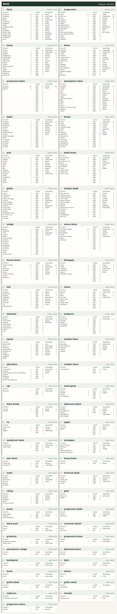

## Rock / Psych / Prog

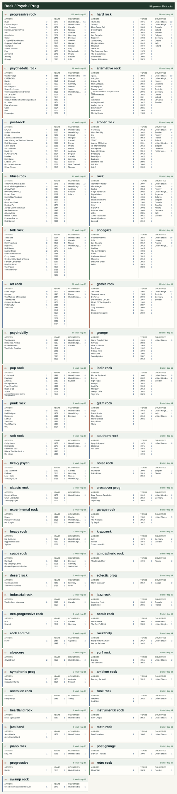

## Electronic / Ambient

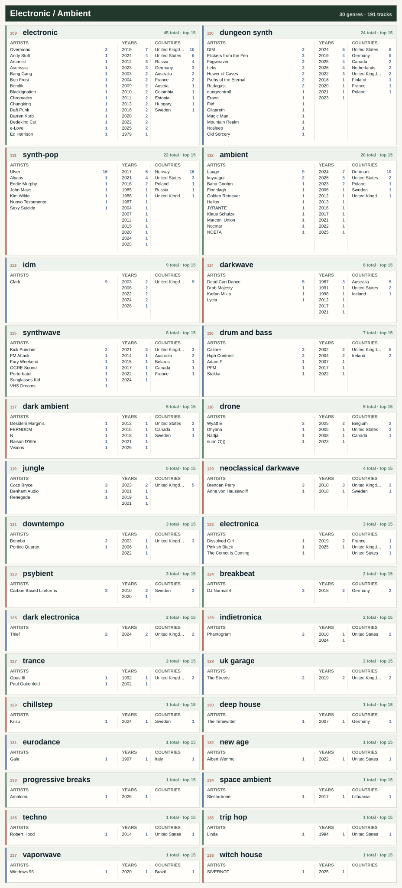

## Punk / Hardcore

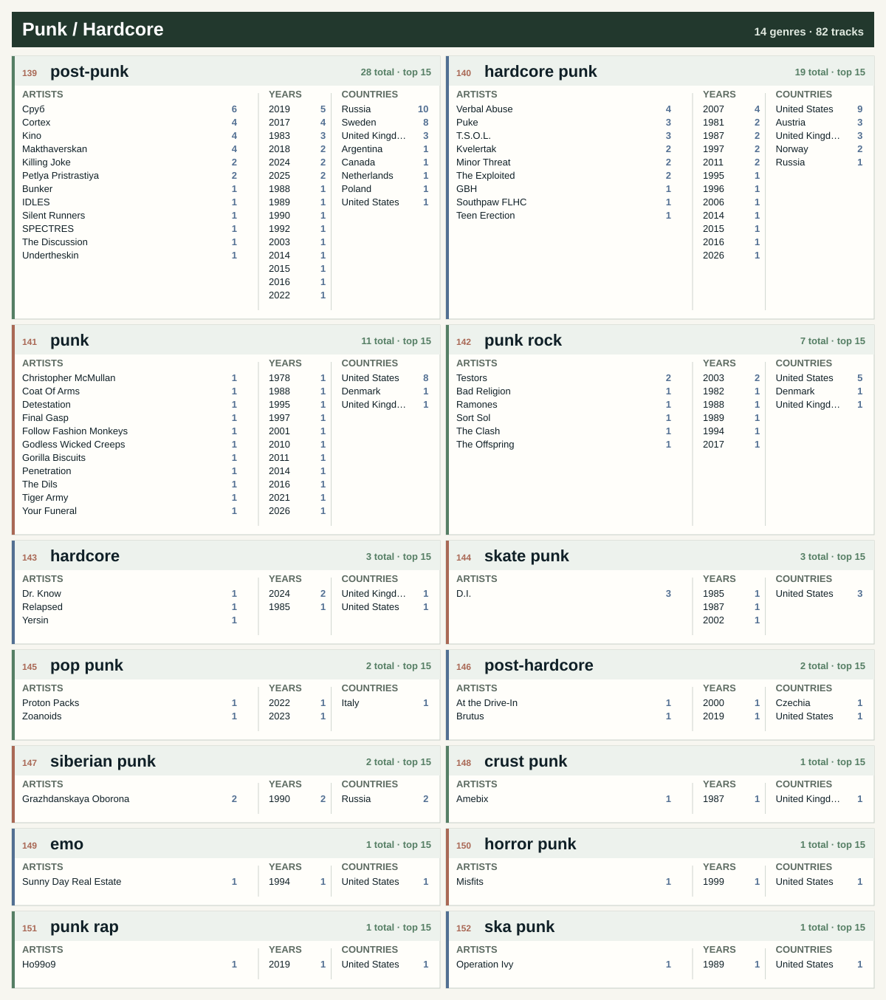

## Folk / World

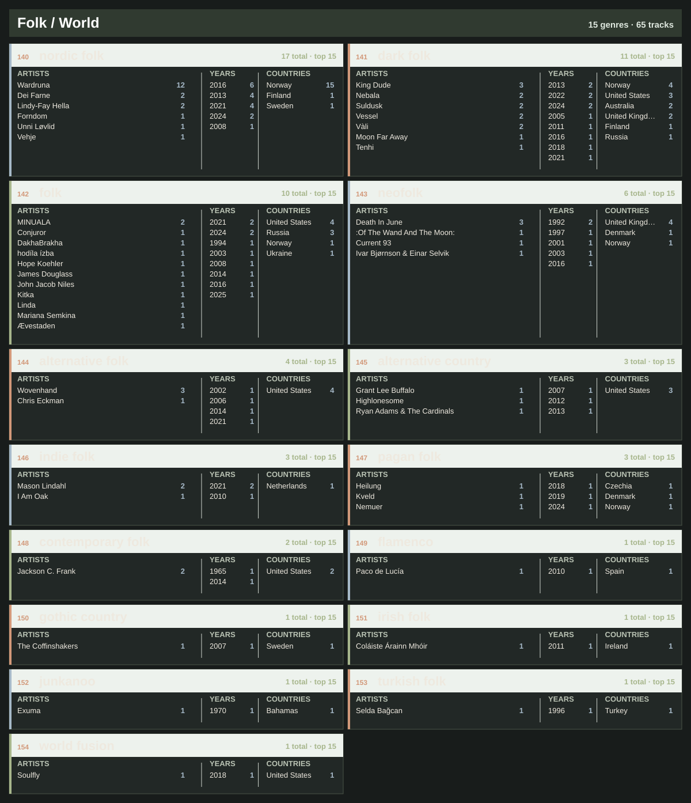

## Jazz / Blues

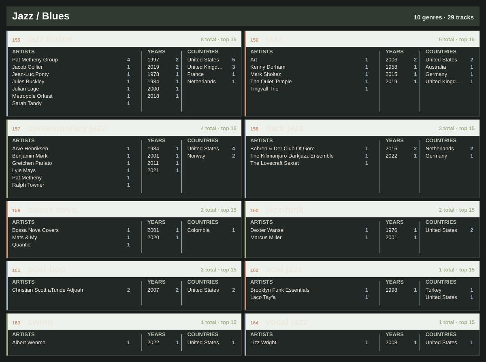

## Soul / Funk / R&B

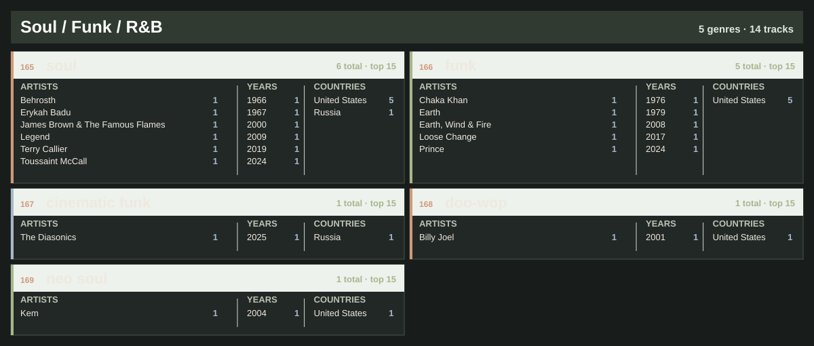

## Reggae / Ska

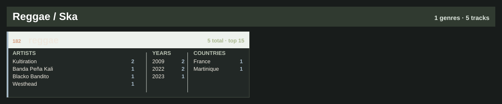

## Afrobeat / Latin

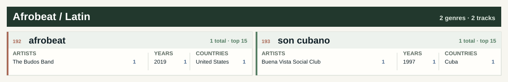

## Classical / Score

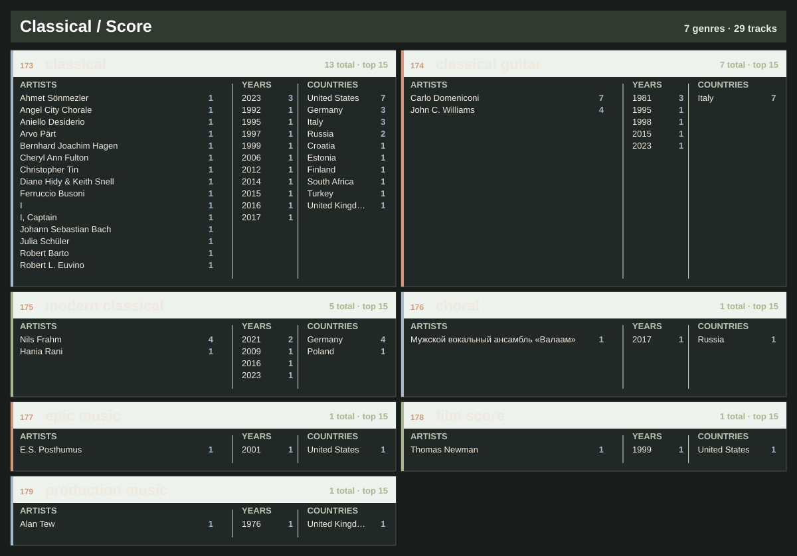

## Pop / Songwriter

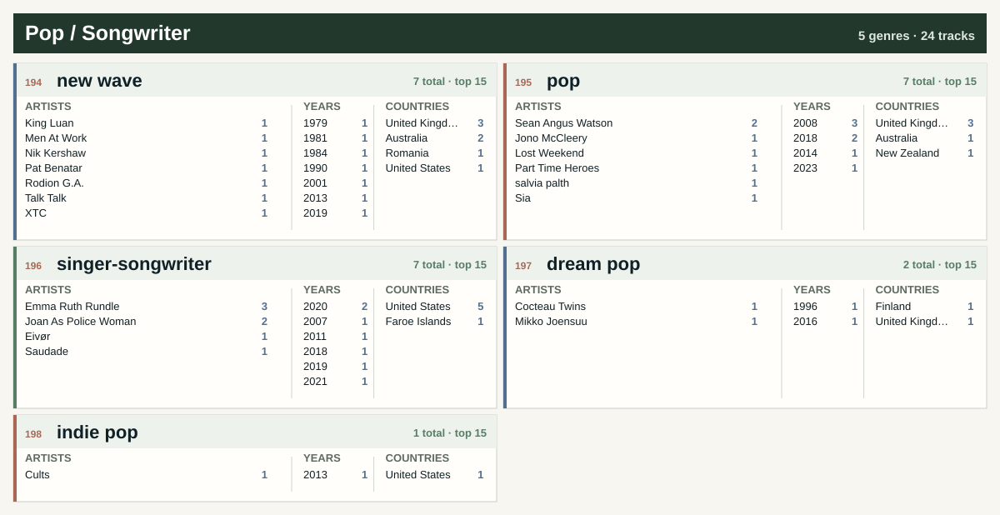

## Hip-Hop / Rap

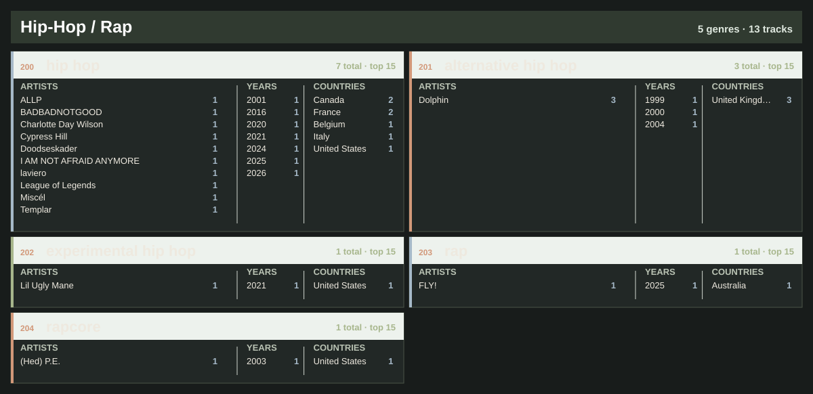

## Experimental / Noise

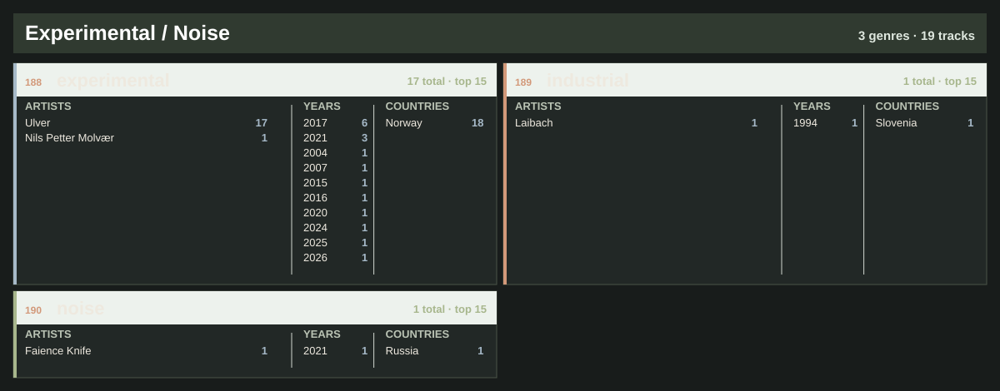

## Latest 20 Liked Tracks

| Added | Artist | Track | Album | Year | Genre |
| --- | --- | --- | --- | --- | --- |
| 2026-06-07 | dungeontroll | [Crypt of Euphoria](https://open.spotify.com/track/02AshrPDkh1K36dD12f2mn) | Into the Castle of the Forbidden Twilight | 2020 | dungeon synth |
| 2026-06-04 | Healthyliving | [Ghost Limbs](https://open.spotify.com/track/1Y3US4jr3hPVYd7k5Bmn16) | Songs of Abundance, Psalms of Grief | 2023 | doom metal |
| 2026-05-26 | Nils Frahm | [Further in the Making](https://open.spotify.com/track/7uYRmq6tONjvwUh8wn8zvh) | Old Friends New Friends | 2021 | modern classical |
| 2026-05-24 | Darkthrone | [So I Marched To The Sunken Empire](https://open.spotify.com/track/57eO5u9HWcifKGw07rrGG4) | Pre-Historic Metal | 2026 | black metal |
| 2026-05-15 | Kaatayra | [Águas Passadas](https://open.spotify.com/track/5IoMPCKmcSlTteXdRVCzCs) | Caminhos de Água | 2026 | atmospheric black metal |
| 2026-05-15 | Conjurer | [Let Us Live](https://open.spotify.com/track/1YXo39c7oKj77QdON48uIA) | Unself | 2025 | sludge metal |
| 2026-05-14 | Summoning | [Flammifer](https://open.spotify.com/track/2L9TUkStJsBHh3Xtw8oUOP) | Old Mornings Dawn | 2013 | black metal |
| 2026-05-14 | Rivers of Nihil | [Terrestria III: Wither](https://open.spotify.com/track/5EtFUoimouxAcK1Dwj60Pz) | Where Owls Know My Name | 2018 | death metal |
| 2026-05-08 | heks | [Protestantisk Fanatiker (London Fields Darkwave)](https://open.spotify.com/track/1Yg1pftEFPMsATyNfkuGYX) | Protestantisk Fanatiker (London Fields Darkwave) | 2026 | electronic |
| 2026-05-08 | Spirit Adrift | [You Will Never Hold The Key](https://open.spotify.com/track/2lIheKkJlthP8A5oeTpdPX) | Infinite Illumination | 2026 | heavy metal |
| 2026-04-29 | BULLDOZER | [The Great Deceiver](https://open.spotify.com/track/1hJ4Go14cllZv8YE6YLIFV) | The Exorcism | 1984 | black metal |
| 2026-04-29 | BULLDOZER | [Another Beer (It's What I Need)](https://open.spotify.com/track/7dsXchfku5959Z14zkzxET) | Fallen Angel / Another Beer (Is What I Need) | 1984 | black metal |
| 2026-04-27 | Üga Büga | [Valley of The Wolf](https://open.spotify.com/track/1fafmxEOMDxm4db8Oz61hi) | Valley of The Wolf (single) | 2026 | heavy metal |
| 2026-04-27 | Immolation | [Bend Towards The Dark](https://open.spotify.com/track/6UBbYpErZJMCL0NIimAOTk) | Descent | 2026 | death metal |
| 2026-04-26 | Space Remedy | [Ineffable Dimensions](https://open.spotify.com/track/4b5szokLXkijlkzBX0aQNj) | Ineffable Dimensions | 2026 | progressive rock |
| 2026-04-26 | Liminal Sky; Ulver | [A Solitary Future](https://open.spotify.com/track/0ShB8rlcQF9yL01mUmAuLx) | A Solitary Future | 2026 | experimental |
| 2026-04-21 | OM | [Bedouin's Vigil](https://open.spotify.com/track/2E26Vgc5DTlScIrYkrCeVG) | Bedouin’s Vigil / Assyrian Blood | 2006 | stoner rock |
| 2026-04-21 | Hanging Garden | [Isle of Bliss](https://open.spotify.com/track/7ez3jbaUX5d4jH9spd3QVu) | Isle of Bliss | 2026 | doom metal |
| 2026-04-16 | Cough | [Let It Bleed](https://open.spotify.com/track/2k4pS2s7JHRiZrc6LB5Xqu) | Still They Pray | 2016 | doom metal |
| 2026-04-15 | The Flight of Sleipnir | [Sidereal Course](https://open.spotify.com/track/0b24z2yYjV75L59h2tVaWX) | V | 2014 | stoner doom |

## Aggregates

### Top 20 Countries

| Country | Tracks |
| --- | --- |
| United States | 619 |
| United Kingdom | 286 |
| Norway | 227 |
| Sweden | 165 |
| Germany | 97 |
| Finland | 73 |
| Canada | 54 |
| France | 50 |
| Russia | 49 |
| Denmark | 37 |
| Netherlands | 32 |
| Italy | 32 |
| Australia | 30 |
| Ireland | 23 |
| Poland | 19 |
| Belgium | 16 |
| Greece | 15 |
| Switzerland | 14 |
| Austria | 12 |
| Hungary | 11 |

### Top 20 Genres

| Genre | Tracks |
| --- | --- |
| black metal | 209 |
| doom metal | 118 |
| progressive rock | 100 |
| progressive metal | 80 |
| hard rock | 75 |
| heavy metal | 74 |
| electronic | 67 |
| alternative rock | 56 |
| psychedelic rock | 46 |
| death metal | 46 |
| post-rock | 42 |
| atmospheric black metal | 42 |
| stoner rock | 39 |
| thrash metal | 38 |
| rock | 29 |
| ambient | 28 |
| sludge metal | 26 |
| post-metal | 26 |
| post-punk | 25 |
| gothic metal | 25 |

### Top 20 Groups / Artists

| Group / artist | Tracks |
| --- | --- |
| Enslaved | 50 |
| Darkthrone | 28 |
| Opeth | 21 |
| Ulver | 17 |
| Shape Of Despair | 12 |
| Wardruna | 12 |
| The Flight of Sleipnir | 10 |
| Clark | 9 |
| Frank Zappa | 9 |
| The Quakes | 9 |
| Lauge | 8 |
| My Dying Bride | 8 |
| Alcest | 7 |
| Biohazard | 7 |
| Carlo Domeniconi | 7 |
| Chelsea Wolfe | 7 |
| Counting Hours | 7 |
| Dark Suns | 7 |
| Devin Townsend | 7 |
| Rush | 7 |

Workflow

- `python scripts/export_spotify.py` updates `data/tracks.csv` from saved tracks and owned/collaborative playlists.
- `python scripts/enrich_genres_musicbrainz.py` fills blank genres from cached MusicBrainz artist tags.
- `python scripts/backfill_countries_musicbrainz.py --fetch-missing-artists` backfills artist countries from MusicBrainz and Wikidata where available.
- `python scripts/apply_genre_rules.py` fills genres from `data/genre_rules.csv`.
- `python scripts/build_readme.py` regenerates this README.
- `python scripts/debug_spotify.py` checks OAuth and first Spotify API pages without writing CSV.
- Manual fields in `data/tracks.csv` are preserved on export: `year`, `primary_genre`, `genres`, `rating`, `status`, `tags`, `notes`.
- Weekly GitHub Actions use a private data repository for `data/tracks.csv`; this public repository commits only generated summaries and public rules.

Repeat this

Create a Spotify app, run the local OAuth export once, store the full `data/tracks.csv` in a private data repository, then set public repository secrets described in `DATA.md`. GitHub Actions can refresh the public dashboard weekly without publishing the full CSV.

Data

- Source table: private `data/tracks.csv` fetched during the weekly workflow and not published in this repository.
- Data setup: [`DATA.md`](DATA.md)
- Track CSV example: [`data/tracks.example.csv`](data/tracks.example.csv)
- Genre rules: [`data/genre_rules.csv`](data/genre_rules.csv)
- Country overrides: [`data/country_overrides.csv`](data/country_overrides.csv)
- README generator: [`scripts/build_readme.py`](scripts/build_readme.py)
- Spotify exporter: [`scripts/export_spotify.py`](scripts/export_spotify.py)
- MusicBrainz country backfill: [`scripts/backfill_countries_musicbrainz.py`](scripts/backfill_countries_musicbrainz.py)
- MusicBrainz genre enricher: [`scripts/enrich_genres_musicbrainz.py`](scripts/enrich_genres_musicbrainz.py)
- Genre rule applier: [`scripts/apply_genre_rules.py`](scripts/apply_genre_rules.py)
- Spotify API debug: [`scripts/debug_spotify.py`](scripts/debug_spotify.py)

_Generated at 2026-06-11 11:04 UTC._
