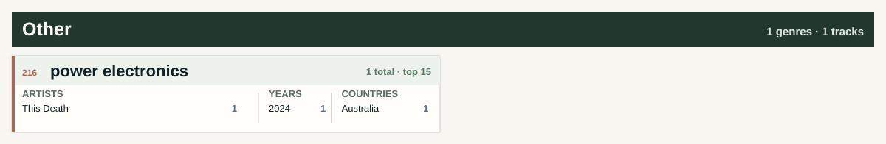

# Maks Krutikov Spotify Library

Personal Spotify metadata dashboard. No audio files, only generated summaries from a private CSV archive.

<table>
<thead>
<tr>
<th>Tracks</th>
<th>Artists</th>
<th>Albums</th>
<th>Tag genres</th>
<th>Assigned genres</th>
<th>Countries</th>
<th>Playlists</th>
<th>Release years</th>
<th>Duration</th>
</tr>
</thead>
<tbody>
<tr>
<td>1972</td>
<td>1366</td>
<td>1677</td>
<td>521</td>
<td>204</td>
<td>53</td>
<td>5</td>
<td>1958-2026</td>
<td>183h 52m</td>
</tr>
</tbody>
</table>

> Each artist is assigned to exactly one dominant genre. Every genre card below shows top 15 artists, years and countries.

## Genre Atlas

## Metal

## Rock / Psych / Prog

## Electronic / Ambient

## Punk / Hardcore

## Folk / World

## Jazz / Blues

## Soul / Funk / R&B

## Reggae / Ska

## Afrobeat / Latin

## Classical / Score

## Pop / Songwriter

## Hip-Hop / Rap

## Experimental / Noise

## Other

## Latest 20 Liked Tracks

<table>
<thead>
<tr>
<th>Added</th>
<th>Artist</th>
<th>Track</th>
<th>Album</th>
<th>Year</th>
<th>Genre</th>
</tr>
</thead>
<tbody>
<tr>
<td>2026-06-07</td>
<td>dungeontroll</td>
<td><a href="https://open.spotify.com/track/02AshrPDkh1K36dD12f2mn">Crypt of Euphoria</a></td>
<td>Into the Castle of the Forbidden Twilight</td>
<td>2020</td>
<td>dungeon synth</td>
</tr>
<tr>
<td>2026-06-04</td>
<td>Healthyliving</td>
<td><a href="https://open.spotify.com/track/1Y3US4jr3hPVYd7k5Bmn16">Ghost Limbs</a></td>
<td>Songs of Abundance, Psalms of Grief</td>
<td>2023</td>
<td></td>
</tr>
<tr>
<td>2026-05-26</td>
<td>Nils Frahm</td>
<td><a href="https://open.spotify.com/track/7uYRmq6tONjvwUh8wn8zvh">Further in the Making</a></td>
<td>Old Friends New Friends</td>
<td>2021</td>
<td>modern classical</td>
</tr>
<tr>
<td>2026-05-24</td>
<td>Darkthrone</td>
<td><a href="https://open.spotify.com/track/57eO5u9HWcifKGw07rrGG4">So I Marched To The Sunken Empire</a></td>
<td>Pre-Historic Metal</td>
<td>2026</td>
<td>black metal</td>
</tr>
<tr>
<td>2026-05-15</td>
<td>Kaatayra</td>
<td><a href="https://open.spotify.com/track/5IoMPCKmcSlTteXdRVCzCs">Águas Passadas</a></td>
<td>Caminhos de Água</td>
<td>2026</td>
<td>atmospheric black metal</td>
</tr>
<tr>
<td>2026-05-15</td>
<td>Conjurer</td>
<td><a href="https://open.spotify.com/track/1YXo39c7oKj77QdON48uIA">Let Us Live</a></td>
<td>Unself</td>
<td>2025</td>
<td>sludge metal</td>
</tr>
<tr>
<td>2026-05-14</td>
<td>Summoning</td>
<td><a href="https://open.spotify.com/track/2L9TUkStJsBHh3Xtw8oUOP">Flammifer</a></td>
<td>Old Mornings Dawn</td>
<td>2013</td>
<td>black metal</td>
</tr>
<tr>
<td>2026-05-14</td>
<td>Rivers of Nihil</td>
<td><a href="https://open.spotify.com/track/5EtFUoimouxAcK1Dwj60Pz">Terrestria III: Wither</a></td>
<td>Where Owls Know My Name</td>
<td>2018</td>
<td>death metal</td>
</tr>
<tr>
<td>2026-05-08</td>
<td>heks</td>
<td><a href="https://open.spotify.com/track/1Yg1pftEFPMsATyNfkuGYX">Protestantisk Fanatiker (London Fields Darkwave)</a></td>
<td>Protestantisk Fanatiker (London Fields Darkwave)</td>
<td>2026</td>
<td>electronic</td>
</tr>
<tr>
<td>2026-05-08</td>
<td>Spirit Adrift</td>
<td><a href="https://open.spotify.com/track/2lIheKkJlthP8A5oeTpdPX">You Will Never Hold The Key</a></td>
<td>Infinite Illumination</td>
<td>2026</td>
<td>heavy metal</td>
</tr>
<tr>
<td>2026-04-29</td>
<td>BULLDOZER</td>
<td><a href="https://open.spotify.com/track/1hJ4Go14cllZv8YE6YLIFV">The Great Deceiver</a></td>
<td>The Exorcism</td>
<td>1984</td>
<td>black metal</td>
</tr>
<tr>
<td>2026-04-29</td>
<td>BULLDOZER</td>
<td><a href="https://open.spotify.com/track/7dsXchfku5959Z14zkzxET">Another Beer (It&#x27;s What I Need)</a></td>
<td>Fallen Angel / Another Beer (Is What I Need)</td>
<td>1984</td>
<td>black metal</td>
</tr>
<tr>
<td>2026-04-27</td>
<td>Üga Büga</td>
<td><a href="https://open.spotify.com/track/1fafmxEOMDxm4db8Oz61hi">Valley of The Wolf</a></td>
<td>Valley of The Wolf (single)</td>
<td>2026</td>
<td>heavy metal</td>
</tr>
<tr>
<td>2026-04-27</td>
<td>Immolation</td>
<td><a href="https://open.spotify.com/track/6UBbYpErZJMCL0NIimAOTk">Bend Towards The Dark</a></td>
<td>Descent</td>
<td>2026</td>
<td>death metal</td>
</tr>
<tr>
<td>2026-04-26</td>
<td>Space Remedy</td>
<td><a href="https://open.spotify.com/track/4b5szokLXkijlkzBX0aQNj">Ineffable Dimensions</a></td>
<td>Ineffable Dimensions</td>
<td>2026</td>
<td>progressive rock</td>
</tr>
<tr>
<td>2026-04-26</td>
<td>Liminal Sky; Ulver</td>
<td><a href="https://open.spotify.com/track/0ShB8rlcQF9yL01mUmAuLx">A Solitary Future</a></td>
<td>A Solitary Future</td>
<td>2026</td>
<td>experimental</td>
</tr>
<tr>
<td>2026-04-21</td>
<td>OM</td>
<td><a href="https://open.spotify.com/track/2E26Vgc5DTlScIrYkrCeVG">Bedouin&#x27;s Vigil</a></td>
<td>Bedouin’s Vigil / Assyrian Blood</td>
<td>2006</td>
<td>stoner rock</td>
</tr>
<tr>
<td>2026-04-21</td>
<td>Hanging Garden</td>
<td><a href="https://open.spotify.com/track/7ez3jbaUX5d4jH9spd3QVu">Isle of Bliss</a></td>
<td>Isle of Bliss</td>
<td>2026</td>
<td>doom metal</td>
</tr>
<tr>
<td>2026-04-16</td>
<td>Cough</td>
<td><a href="https://open.spotify.com/track/2k4pS2s7JHRiZrc6LB5Xqu">Let It Bleed</a></td>
<td>Still They Pray</td>
<td>2016</td>
<td>doom metal</td>
</tr>
<tr>
<td>2026-04-15</td>
<td>The Flight of Sleipnir</td>
<td><a href="https://open.spotify.com/track/0b24z2yYjV75L59h2tVaWX">Sidereal Course</a></td>
<td>V</td>
<td>2014</td>
<td>stoner doom</td>
</tr>
</tbody>
</table>

## Aggregates

### Top 20 Countries

<table>
<thead>
<tr>
<th>Country</th>
<th>Tracks</th>
</tr>
</thead>
<tbody>
<tr>
<td>United States</td>
<td>621</td>
</tr>
<tr>
<td>United Kingdom</td>
<td>286</td>
</tr>
<tr>
<td>Norway</td>
<td>227</td>
</tr>
<tr>
<td>Sweden</td>
<td>165</td>
</tr>
<tr>
<td>Germany</td>
<td>97</td>
</tr>
<tr>
<td>Finland</td>
<td>74</td>
</tr>
<tr>
<td>Canada</td>
<td>54</td>
</tr>
<tr>
<td>France</td>
<td>50</td>
</tr>
<tr>
<td>Russia</td>
<td>49</td>
</tr>
<tr>
<td>Denmark</td>
<td>37</td>
</tr>
<tr>
<td>Netherlands</td>
<td>32</td>
</tr>
<tr>
<td>Italy</td>
<td>32</td>
</tr>
<tr>
<td>Australia</td>
<td>30</td>
</tr>
<tr>
<td>Ireland</td>
<td>23</td>
</tr>
<tr>
<td>Poland</td>
<td>20</td>
</tr>
<tr>
<td>Belgium</td>
<td>16</td>
</tr>
<tr>
<td>Greece</td>
<td>15</td>
</tr>
<tr>
<td>Switzerland</td>
<td>14</td>
</tr>
<tr>
<td>Austria</td>
<td>12</td>
</tr>
<tr>
<td>Hungary</td>
<td>11</td>
</tr>
</tbody>
</table>

### Top 20 Genres

<table>
<thead>
<tr>
<th>Genre</th>
<th>Tracks</th>
</tr>
</thead>
<tbody>
<tr>
<td>black metal</td>
<td>209</td>
</tr>
<tr>
<td>doom metal</td>
<td>117</td>
</tr>
<tr>
<td>progressive rock</td>
<td>99</td>
</tr>
<tr>
<td>progressive metal</td>
<td>80</td>
</tr>
<tr>
<td>heavy metal</td>
<td>74</td>
</tr>
<tr>
<td>hard rock</td>
<td>74</td>
</tr>
<tr>
<td>electronic</td>
<td>67</td>
</tr>
<tr>
<td>alternative rock</td>
<td>53</td>
</tr>
<tr>
<td>death metal</td>
<td>46</td>
</tr>
<tr>
<td>psychedelic rock</td>
<td>44</td>
</tr>
<tr>
<td>atmospheric black metal</td>
<td>42</td>
</tr>
<tr>
<td>post-rock</td>
<td>41</td>
</tr>
<tr>
<td>stoner rock</td>
<td>38</td>
</tr>
<tr>
<td>thrash metal</td>
<td>38</td>
</tr>
<tr>
<td>rock</td>
<td>29</td>
</tr>
<tr>
<td>ambient</td>
<td>28</td>
</tr>
<tr>
<td>post-metal</td>
<td>27</td>
</tr>
<tr>
<td>sludge metal</td>
<td>26</td>
</tr>
<tr>
<td>gothic metal</td>
<td>26</td>
</tr>
<tr>
<td>post-punk</td>
<td>24</td>
</tr>
</tbody>
</table>

### Top 20 Groups / Artists

<table>
<thead>
<tr>
<th>Group / artist</th>
<th>Tracks</th>
</tr>
</thead>
<tbody>
<tr>
<td>Enslaved</td>
<td>50</td>
</tr>
<tr>
<td>Darkthrone</td>
<td>28</td>
</tr>
<tr>
<td>Opeth</td>
<td>21</td>
</tr>
<tr>
<td>Ulver</td>
<td>17</td>
</tr>
<tr>
<td>Shape Of Despair</td>
<td>12</td>
</tr>
<tr>
<td>Wardruna</td>
<td>12</td>
</tr>
<tr>
<td>The Flight of Sleipnir</td>
<td>10</td>
</tr>
<tr>
<td>Clark</td>
<td>9</td>
</tr>
<tr>
<td>Frank Zappa</td>
<td>9</td>
</tr>
<tr>
<td>The Quakes</td>
<td>9</td>
</tr>
<tr>
<td>Lauge</td>
<td>8</td>
</tr>
<tr>
<td>My Dying Bride</td>
<td>8</td>
</tr>
<tr>
<td>Alcest</td>
<td>7</td>
</tr>
<tr>
<td>Biohazard</td>
<td>7</td>
</tr>
<tr>
<td>Carlo Domeniconi</td>
<td>7</td>
</tr>
<tr>
<td>Chelsea Wolfe</td>
<td>7</td>
</tr>
<tr>
<td>Counting Hours</td>
<td>7</td>
</tr>
<tr>
<td>Dark Suns</td>
<td>7</td>
</tr>
<tr>
<td>Devin Townsend</td>
<td>7</td>
</tr>
<tr>
<td>Rush</td>
<td>7</td>
</tr>
</tbody>
</table>

Workflow

- `python scripts/export_spotify.py` updates `data/tracks.csv` from saved tracks and owned/collaborative playlists.
- `python scripts/enrich_genres_musicbrainz.py` fills blank genres from cached MusicBrainz artist tags.
- `python scripts/backfill_countries_musicbrainz.py --fetch-missing-artists` backfills artist countries from MusicBrainz and Wikidata where available.
- `python scripts/apply_genre_rules.py` fills genres from `data/genre_rules.csv`.
- `python scripts/build_readme.py` regenerates this README.
- `python scripts/debug_spotify.py` checks OAuth and first Spotify API pages without writing CSV.
- Manual fields in `data/tracks.csv` are preserved on export: `year`, `primary_genre`, `genres`, `rating`, `status`, `tags`, `notes`.
- Weekly GitHub Actions use a private data repository for `data/tracks.csv`; this public repository commits only generated summaries and public rules.

Repeat this

Create a Spotify app, run the local OAuth export once, store the full `data/tracks.csv` in a private data repository, then set public repository secrets described in `DATA.md`. GitHub Actions can refresh the public dashboard weekly without publishing the full CSV.

Data

- Source table: private `data/tracks.csv` fetched during the weekly workflow and not published in this repository.
- Data setup: [`DATA.md`](DATA.md)
- Track CSV example: [`data/tracks.example.csv`](data/tracks.example.csv)
- Genre rules: [`data/genre_rules.csv`](data/genre_rules.csv)
- Country overrides: [`data/country_overrides.csv`](data/country_overrides.csv)
- README generator: [`scripts/build_readme.py`](scripts/build_readme.py)
- Spotify exporter: [`scripts/export_spotify.py`](scripts/export_spotify.py)
- MusicBrainz country backfill: [`scripts/backfill_countries_musicbrainz.py`](scripts/backfill_countries_musicbrainz.py)
- MusicBrainz genre enricher: [`scripts/enrich_genres_musicbrainz.py`](scripts/enrich_genres_musicbrainz.py)
- Genre rule applier: [`scripts/apply_genre_rules.py`](scripts/apply_genre_rules.py)
- Spotify API debug: [`scripts/debug_spotify.py`](scripts/debug_spotify.py)

_Generated at 2026-06-13 07:39 UTC._
