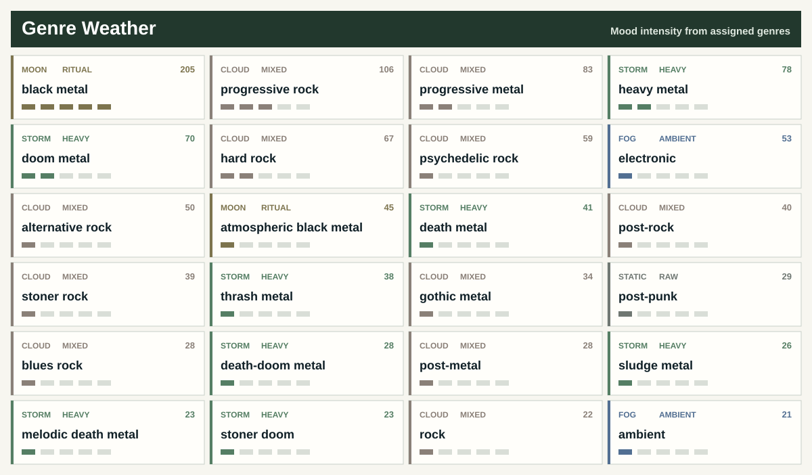

# Maks Krutikov Spotify Library

Personal Spotify metadata dashboard. No audio files, only generated summaries from a private CSV archive.

> Each artist is assigned to exactly one dominant genre. Every genre card below shows top 15 artists, years and countries.

## Listening Maps

### Spotify Covers

## Genre Atlas

## Metal

## Rock / Psych / Prog

## Electronic / Ambient

## Punk / Hardcore

## Folk / World

## Jazz / Blues

## Soul / Funk / R&B

## Reggae / Ska

## Afrobeat / Latin

## Classical / Score

## Pop / Songwriter

## Hip-Hop / Rap

## Experimental / Noise

## Other

## Latest 20 Liked Tracks

<table align="center" cellpadding="0" cellspacing="0">
<thead>
<tr>
<th align="center" valign="middle" nowrap><small><small><small>Added</small></small></small></th>
<th align="center" valign="middle" nowrap><small><small><small>Artist</small></small></small></th>
<th align="center" valign="middle" nowrap><small><small><small>Track</small></small></small></th>
<th align="center" valign="middle" nowrap><small><small><small>Album</small></small></small></th>
<th align="center" valign="middle" nowrap><small><small><small>Year</small></small></small></th>
<th align="center" valign="middle" nowrap><small><small><small>Genre</small></small></small></th>
</tr>
</thead>
<tbody>
<tr>
<td align="center" valign="middle" nowrap><small><small><small>2026&#8209;06&#8209;19</small></small></small></td>
<td align="center" valign="middle" nowrap><small><small><small>Amber&nbsp;Creek</small></small></small></td>
<td align="center" valign="middle" nowrap><small><small><small><a href="https://open.spotify.com/track/2L32tvX6I73xToPvqFMi9k">Don&#x27;t&nbsp;Run&nbsp;Away</a></small></small></small></td>
<td align="center" valign="middle" nowrap><small><small><small>Don&#x27;t&nbsp;Run&nbsp;Away</small></small></small></td>
<td align="center" valign="middle" nowrap><small><small><small>2026</small></small></small></td>
<td align="center" valign="middle" nowrap><small><small><small>electronic</small></small></small></td>
</tr>
<tr>
<td align="center" valign="middle" nowrap><small><small><small>2026&#8209;06&#8209;19</small></small></small></td>
<td align="center" valign="middle" nowrap><small><small><small>Yes</small></small></small></td>
<td align="center" valign="middle" nowrap><small><small><small><a href="https://open.spotify.com/track/6nMY6W3CvmBEOHTGrlm6PC">Love&nbsp;Lies&nbsp;Dreaming</a></small></small></small></td>
<td align="center" valign="middle" nowrap><small><small><small>Aurora&nbsp;(Bonus&nbsp;Tracks&nbsp;Edition)</small></small></small></td>
<td align="center" valign="middle" nowrap><small><small><small>2026</small></small></small></td>
<td align="center" valign="middle" nowrap><small><small><small>progressive&nbsp;rock</small></small></small></td>
</tr>
<tr>
<td align="center" valign="middle" nowrap><small><small><small>2026&#8209;06&#8209;18</small></small></small></td>
<td align="center" valign="middle" nowrap><small><small><small>Fionnlagh;&nbsp;Lauge</small></small></small></td>
<td align="center" valign="middle" nowrap><small><small><small><a href="https://open.spotify.com/track/5CKwsEAhZogWhqWbGYQ4Da">Between&nbsp;Layers</a></small></small></small></td>
<td align="center" valign="middle" nowrap><small><small><small>Between&nbsp;Layers</small></small></small></td>
<td align="center" valign="middle" nowrap><small><small><small>2026</small></small></small></td>
<td align="center" valign="middle" nowrap><small><small><small>ambient</small></small></small></td>
</tr>
<tr>
<td align="center" valign="middle" nowrap><small><small><small>2026&#8209;06&#8209;17</small></small></small></td>
<td align="center" valign="middle" nowrap><small><small><small>This&nbsp;Winter&nbsp;Machine</small></small></small></td>
<td align="center" valign="middle" nowrap><small><small><small><a href="https://open.spotify.com/track/4W6MueOc6KliVlG0ZcZLQN">Reflections</a></small></small></small></td>
<td align="center" valign="middle" nowrap><small><small><small>The&nbsp;Clockwork&nbsp;Man</small></small></small></td>
<td align="center" valign="middle" nowrap><small><small><small>2023</small></small></small></td>
<td align="center" valign="middle" nowrap><small><small><small>progressive&nbsp;rock</small></small></small></td>
</tr>
<tr>
<td align="center" valign="middle" nowrap><small><small><small>2026&#8209;06&#8209;17</small></small></small></td>
<td align="center" valign="middle" nowrap><small><small><small>Pallbearer</small></small></small></td>
<td align="center" valign="middle" nowrap><small><small><small><a href="https://open.spotify.com/track/2SV69wiCCKzoFLDs6NWM5N">I&nbsp;Saw&nbsp;the&nbsp;End</a></small></small></small></td>
<td align="center" valign="middle" nowrap><small><small><small>Heartless</small></small></small></td>
<td align="center" valign="middle" nowrap><small><small><small>2017</small></small></small></td>
<td align="center" valign="middle" nowrap><small><small><small>doom&nbsp;metal</small></small></small></td>
</tr>
<tr>
<td align="center" valign="middle" nowrap><small><small><small>2026&#8209;06&#8209;15</small></small></small></td>
<td align="center" valign="middle" nowrap><small><small><small>Magic&nbsp;Man</small></small></small></td>
<td align="center" valign="middle" nowrap><small><small><small><a href="https://open.spotify.com/track/23tqZZq7hLy54A952keiLm">Steppe&nbsp;Grass</a></small></small></small></td>
<td align="center" valign="middle" nowrap><small><small><small>Boards&nbsp;of&nbsp;Mongolia</small></small></small></td>
<td align="center" valign="middle" nowrap><small><small><small>2026</small></small></small></td>
<td align="center" valign="middle" nowrap><small><small><small>dungeon&nbsp;synth</small></small></small></td>
</tr>
<tr>
<td align="center" valign="middle" nowrap><small><small><small>2026&#8209;06&#8209;07</small></small></small></td>
<td align="center" valign="middle" nowrap><small><small><small>dungeontroll</small></small></small></td>
<td align="center" valign="middle" nowrap><small><small><small><a href="https://open.spotify.com/track/02AshrPDkh1K36dD12f2mn">Crypt&nbsp;of&nbsp;Euphoria</a></small></small></small></td>
<td align="center" valign="middle" nowrap><small><small><small>Into&nbsp;the&nbsp;Castle&nbsp;of&nbsp;the&nbsp;Forbidden&nbsp;Twilight</small></small></small></td>
<td align="center" valign="middle" nowrap><small><small><small>2020</small></small></small></td>
<td align="center" valign="middle" nowrap><small><small><small>dungeon&nbsp;synth</small></small></small></td>
</tr>
<tr>
<td align="center" valign="middle" nowrap><small><small><small>2026&#8209;06&#8209;04</small></small></small></td>
<td align="center" valign="middle" nowrap><small><small><small>Healthyliving</small></small></small></td>
<td align="center" valign="middle" nowrap><small><small><small><a href="https://open.spotify.com/track/1Y3US4jr3hPVYd7k5Bmn16">Ghost&nbsp;Limbs</a></small></small></small></td>
<td align="center" valign="middle" nowrap><small><small><small>Songs&nbsp;of&nbsp;Abundance,&nbsp;Psalms&nbsp;of&nbsp;Grief</small></small></small></td>
<td align="center" valign="middle" nowrap><small><small><small>2023</small></small></small></td>
<td align="center" valign="middle" nowrap><small><small><small></small></small></small></td>
</tr>
<tr>
<td align="center" valign="middle" nowrap><small><small><small>2026&#8209;05&#8209;26</small></small></small></td>
<td align="center" valign="middle" nowrap><small><small><small>Nils&nbsp;Frahm</small></small></small></td>
<td align="center" valign="middle" nowrap><small><small><small><a href="https://open.spotify.com/track/7uYRmq6tONjvwUh8wn8zvh">Further&nbsp;in&nbsp;the&nbsp;Making</a></small></small></small></td>
<td align="center" valign="middle" nowrap><small><small><small>Old&nbsp;Friends&nbsp;New&nbsp;Friends</small></small></small></td>
<td align="center" valign="middle" nowrap><small><small><small>2021</small></small></small></td>
<td align="center" valign="middle" nowrap><small><small><small>modern&nbsp;classical</small></small></small></td>
</tr>
<tr>
<td align="center" valign="middle" nowrap><small><small><small>2026&#8209;05&#8209;24</small></small></small></td>
<td align="center" valign="middle" nowrap><small><small><small>Darkthrone</small></small></small></td>
<td align="center" valign="middle" nowrap><small><small><small><a href="https://open.spotify.com/track/57eO5u9HWcifKGw07rrGG4">So&nbsp;I&nbsp;Marched&nbsp;To&nbsp;The&nbsp;Sunken&nbsp;Empire</a></small></small></small></td>
<td align="center" valign="middle" nowrap><small><small><small>Pre&#8209;Historic&nbsp;Metal</small></small></small></td>
<td align="center" valign="middle" nowrap><small><small><small>2026</small></small></small></td>
<td align="center" valign="middle" nowrap><small><small><small>black&nbsp;metal</small></small></small></td>
</tr>
<tr>
<td align="center" valign="middle" nowrap><small><small><small>2026&#8209;05&#8209;15</small></small></small></td>
<td align="center" valign="middle" nowrap><small><small><small>Kaatayra</small></small></small></td>
<td align="center" valign="middle" nowrap><small><small><small><a href="https://open.spotify.com/track/5IoMPCKmcSlTteXdRVCzCs">Águas&nbsp;Passadas</a></small></small></small></td>
<td align="center" valign="middle" nowrap><small><small><small>Caminhos&nbsp;de&nbsp;Água</small></small></small></td>
<td align="center" valign="middle" nowrap><small><small><small>2026</small></small></small></td>
<td align="center" valign="middle" nowrap><small><small><small>atmospheric&nbsp;black&nbsp;metal</small></small></small></td>
</tr>
<tr>
<td align="center" valign="middle" nowrap><small><small><small>2026&#8209;05&#8209;15</small></small></small></td>
<td align="center" valign="middle" nowrap><small><small><small>Conjurer</small></small></small></td>
<td align="center" valign="middle" nowrap><small><small><small><a href="https://open.spotify.com/track/1YXo39c7oKj77QdON48uIA">Let&nbsp;Us&nbsp;Live</a></small></small></small></td>
<td align="center" valign="middle" nowrap><small><small><small>Unself</small></small></small></td>
<td align="center" valign="middle" nowrap><small><small><small>2025</small></small></small></td>
<td align="center" valign="middle" nowrap><small><small><small>sludge&nbsp;metal</small></small></small></td>
</tr>
<tr>
<td align="center" valign="middle" nowrap><small><small><small>2026&#8209;05&#8209;14</small></small></small></td>
<td align="center" valign="middle" nowrap><small><small><small>Summoning</small></small></small></td>
<td align="center" valign="middle" nowrap><small><small><small><a href="https://open.spotify.com/track/2L9TUkStJsBHh3Xtw8oUOP">Flammifer</a></small></small></small></td>
<td align="center" valign="middle" nowrap><small><small><small>Old&nbsp;Mornings&nbsp;Dawn</small></small></small></td>
<td align="center" valign="middle" nowrap><small><small><small>2013</small></small></small></td>
<td align="center" valign="middle" nowrap><small><small><small>black&nbsp;metal</small></small></small></td>
</tr>
<tr>
<td align="center" valign="middle" nowrap><small><small><small>2026&#8209;05&#8209;14</small></small></small></td>
<td align="center" valign="middle" nowrap><small><small><small>Rivers&nbsp;of&nbsp;Nihil</small></small></small></td>
<td align="center" valign="middle" nowrap><small><small><small><a href="https://open.spotify.com/track/5EtFUoimouxAcK1Dwj60Pz">Terrestria&nbsp;III:&nbsp;Wither</a></small></small></small></td>
<td align="center" valign="middle" nowrap><small><small><small>Where&nbsp;Owls&nbsp;Know&nbsp;My&nbsp;Name</small></small></small></td>
<td align="center" valign="middle" nowrap><small><small><small>2018</small></small></small></td>
<td align="center" valign="middle" nowrap><small><small><small>death&nbsp;metal</small></small></small></td>
</tr>
<tr>
<td align="center" valign="middle" nowrap><small><small><small>2026&#8209;05&#8209;08</small></small></small></td>
<td align="center" valign="middle" nowrap><small><small><small>heks</small></small></small></td>
<td align="center" valign="middle" nowrap><small><small><small><a href="https://open.spotify.com/track/1Yg1pftEFPMsATyNfkuGYX">Protestantisk&nbsp;Fanatiker&nbsp;(London&nbsp;Fields&nbsp;Darkwave)</a></small></small></small></td>
<td align="center" valign="middle" nowrap><small><small><small>Protestantisk&nbsp;Fanatiker&nbsp;(London&nbsp;Fields&nbsp;Darkwave)</small></small></small></td>
<td align="center" valign="middle" nowrap><small><small><small>2026</small></small></small></td>
<td align="center" valign="middle" nowrap><small><small><small>electronic</small></small></small></td>
</tr>
<tr>
<td align="center" valign="middle" nowrap><small><small><small>2026&#8209;05&#8209;08</small></small></small></td>
<td align="center" valign="middle" nowrap><small><small><small>Spirit&nbsp;Adrift</small></small></small></td>
<td align="center" valign="middle" nowrap><small><small><small><a href="https://open.spotify.com/track/2lIheKkJlthP8A5oeTpdPX">You&nbsp;Will&nbsp;Never&nbsp;Hold&nbsp;The&nbsp;Key</a></small></small></small></td>
<td align="center" valign="middle" nowrap><small><small><small>Infinite&nbsp;Illumination</small></small></small></td>
<td align="center" valign="middle" nowrap><small><small><small>2026</small></small></small></td>
<td align="center" valign="middle" nowrap><small><small><small>heavy&nbsp;metal</small></small></small></td>
</tr>
<tr>
<td align="center" valign="middle" nowrap><small><small><small>2026&#8209;04&#8209;29</small></small></small></td>
<td align="center" valign="middle" nowrap><small><small><small>BULLDOZER</small></small></small></td>
<td align="center" valign="middle" nowrap><small><small><small><a href="https://open.spotify.com/track/1hJ4Go14cllZv8YE6YLIFV">The&nbsp;Great&nbsp;Deceiver</a></small></small></small></td>
<td align="center" valign="middle" nowrap><small><small><small>The&nbsp;Exorcism</small></small></small></td>
<td align="center" valign="middle" nowrap><small><small><small>1984</small></small></small></td>
<td align="center" valign="middle" nowrap><small><small><small>speed&nbsp;metal</small></small></small></td>
</tr>
<tr>
<td align="center" valign="middle" nowrap><small><small><small>2026&#8209;04&#8209;29</small></small></small></td>
<td align="center" valign="middle" nowrap><small><small><small>BULLDOZER</small></small></small></td>
<td align="center" valign="middle" nowrap><small><small><small><a href="https://open.spotify.com/track/7dsXchfku5959Z14zkzxET">Another&nbsp;Beer&nbsp;(It&#x27;s&nbsp;What&nbsp;I&nbsp;Need)</a></small></small></small></td>
<td align="center" valign="middle" nowrap><small><small><small>Fallen&nbsp;Angel&nbsp;/&nbsp;Another&nbsp;Beer&nbsp;(Is&nbsp;What&nbsp;I&nbsp;Need)</small></small></small></td>
<td align="center" valign="middle" nowrap><small><small><small>1984</small></small></small></td>
<td align="center" valign="middle" nowrap><small><small><small>speed&nbsp;metal</small></small></small></td>
</tr>
<tr>
<td align="center" valign="middle" nowrap><small><small><small>2026&#8209;04&#8209;27</small></small></small></td>
<td align="center" valign="middle" nowrap><small><small><small>Üga&nbsp;Büga</small></small></small></td>
<td align="center" valign="middle" nowrap><small><small><small><a href="https://open.spotify.com/track/1fafmxEOMDxm4db8Oz61hi">Valley&nbsp;of&nbsp;The&nbsp;Wolf</a></small></small></small></td>
<td align="center" valign="middle" nowrap><small><small><small>Valley&nbsp;of&nbsp;The&nbsp;Wolf&nbsp;(single)</small></small></small></td>
<td align="center" valign="middle" nowrap><small><small><small>2026</small></small></small></td>
<td align="center" valign="middle" nowrap><small><small><small>heavy&nbsp;metal</small></small></small></td>
</tr>
<tr>
<td align="center" valign="middle" nowrap><small><small><small>2026&#8209;04&#8209;27</small></small></small></td>
<td align="center" valign="middle" nowrap><small><small><small>Immolation</small></small></small></td>
<td align="center" valign="middle" nowrap><small><small><small><a href="https://open.spotify.com/track/6UBbYpErZJMCL0NIimAOTk">Bend&nbsp;Towards&nbsp;The&nbsp;Dark</a></small></small></small></td>
<td align="center" valign="middle" nowrap><small><small><small>Descent</small></small></small></td>
<td align="center" valign="middle" nowrap><small><small><small>2026</small></small></small></td>
<td align="center" valign="middle" nowrap><small><small><small>death&nbsp;metal</small></small></small></td>
</tr>
</tbody>
</table>

## Aggregates

Workflow

- `python scripts/export_spotify.py` updates `data/tracks.csv` from saved tracks and owned/collaborative playlists, plus optional Spotify top/recent snapshots.
- `python scripts/enrich_genres_musicbrainz.py` fills blank genres from cached MusicBrainz artist tags.
- `python scripts/backfill_countries_musicbrainz.py --fetch-missing-artists` backfills artist countries from MusicBrainz and Wikidata where available.
- `python scripts/apply_genre_rules.py --overwrite` applies curated genres from `data/genre_rules.csv`.
- `python scripts/build_readme.py` regenerates this README.
- `python scripts/debug_spotify.py` checks OAuth and first Spotify API pages without writing CSV.
- Manual fields in `data/tracks.csv` are preserved on export: `year`, `primary_genre`, `genres`, `rating`, `status`, `tags`, `notes`.
- Weekly GitHub Actions use a private data repository for `data/tracks.csv`; this public repository commits only generated summaries and public rules.

Repeat this

Create a Spotify app, run the local OAuth export once, store the full `data/tracks.csv` in a private data repository, then set public repository secrets described in `DATA.md`. GitHub Actions can refresh the public dashboard weekly without publishing the full CSV. Spotify user refresh tokens expire after six months; when the workflow reports `invalid_grant`, or after adding `user-top-read` / `user-read-recently-played`, reauthorize locally and update the `SPOTIFY_REFRESH_TOKEN` secret.

Data

- Source table: private `data/tracks.csv` fetched during the weekly workflow and not published in this repository.
- Data setup: [`DATA.md`](DATA.md)
- Track CSV example: [`data/tracks.example.csv`](data/tracks.example.csv)
- Genre rules: [`data/genre_rules.csv`](data/genre_rules.csv)
- Country overrides: [`data/country_overrides.csv`](data/country_overrides.csv)
- README generator: [`scripts/build_readme.py`](scripts/build_readme.py)
- Spotify exporter: [`scripts/export_spotify.py`](scripts/export_spotify.py)
- MusicBrainz country backfill: [`scripts/backfill_countries_musicbrainz.py`](scripts/backfill_countries_musicbrainz.py)
- MusicBrainz genre enricher: [`scripts/enrich_genres_musicbrainz.py`](scripts/enrich_genres_musicbrainz.py)
- Genre rule applier: [`scripts/apply_genre_rules.py`](scripts/apply_genre_rules.py)
- Spotify API debug: [`scripts/debug_spotify.py`](scripts/debug_spotify.py)

_Generated at 2026-06-22 10:48 UTC._
