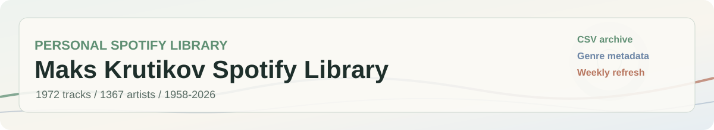
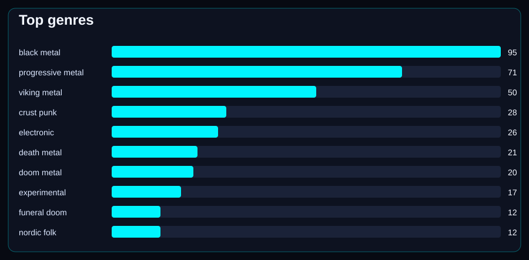
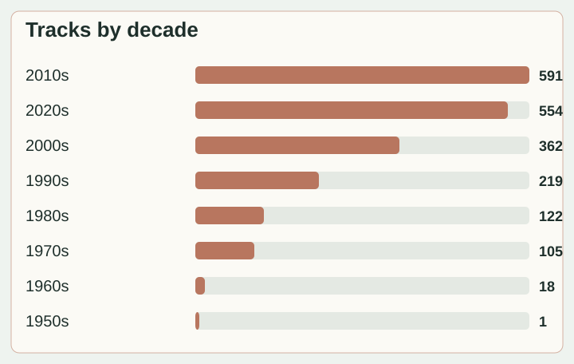

**Maks Krutikov Spotify Library** / personal metadata dashboard. No audio files, only Spotify track data and local CSV edits.

 

## Signal

| Tracks | Artists | Albums | Genres | Playlists | Release years | Total duration |
| --- | --- | --- | --- | --- | --- | --- |
| 1971 | 1367 | 1676 | 28 | 5 | 1958-2026 | 183h 51m |

## Frequencies

| Genre | Tracks |
| --- | --- |
| black metal | 95 |
| progressive metal | 71 |
| viking metal | 50 |
| crust punk | 28 |
| electronic | 26 |
| death metal | 21 |
| doom metal | 20 |
| experimental | 17 |
| funeral doom | 12 |
| nordic folk | 12 |
| dark folk | 12 |
| stoner doom | 10 |
| folk metal | 10 |
| idm | 9 |
| art rock | 9 |

## Primary

| Primary genre | Tracks |
| --- | --- |
| black metal | 78 |
| progressive metal | 21 |
| experimental | 17 |
| funeral doom | 12 |
| nordic folk | 12 |
| stoner doom | 10 |
| electronic | 9 |
| art rock | 9 |
| psychobilly | 9 |
| ambient | 8 |
| doom metal | 8 |
| blackgaze | 7 |
| hardcore | 7 |
| classical | 7 |

## Artists

| Artist | Tracks |
| --- | --- |
| Enslaved | 50 |
| Darkthrone | 28 |
| Opeth | 21 |
| Ulver | 17 |
| Shape Of Despair | 12 |
| Wardruna | 12 |
| The Flight of Sleipnir | 10 |
| Clark | 9 |
| Frank Zappa | 9 |
| The Quakes | 9 |
| Lauge | 8 |
| My Dying Bride | 8 |
| Alcest | 7 |
| Biohazard | 7 |
| Carlo Domeniconi | 7 |

## Decades

| Decade | Tracks |
| --- | --- |
| 2010s | 591 |
| 2020s | 553 |
| 2000s | 362 |
| 1990s | 219 |
| 1980s | 122 |
| 1970s | 105 |
| 1960s | 18 |
| 1950s | 1 |

## Latest

| Track | Artists | Year | Added |
| --- | --- | --- | --- |
| So I Marched To The Sunken Empire | Darkthrone | 2026 | 2026-05-24 |
| Águas Passadas | Kaatayra | 2026 | 2026-05-15 |
| Let Us Live | Conjurer | 2025 | 2026-05-15 |
| Flammifer | Summoning | 2013 | 2026-05-14 |
| Terrestria III: Wither | Rivers of Nihil | 2018 | 2026-05-14 |
| Protestantisk Fanatiker (London Fields Darkwave) | heks | 2026 | 2026-05-08 |
| You Will Never Hold The Key | Spirit Adrift | 2026 | 2026-05-08 |
| The Great Deceiver | BULLDOZER | 1984 | 2026-04-29 |
| Another Beer (It's What I Need) | BULLDOZER | 1984 | 2026-04-29 |
| Valley of The Wolf | Üga Büga | 2026 | 2026-04-27 |
| Bend Towards The Dark | Immolation | 2026 | 2026-04-27 |
| Ineffable Dimensions | Space Remedy | 2026 | 2026-04-26 |

Workflow

- `python scripts/export_spotify.py` updates `data/tracks.csv` from saved tracks and owned/collaborative playlists.
- `python scripts/apply_genre_rules.py` fills genres from `data/genre_rules.csv`.
- `python scripts/build_readme.py` regenerates this README and SVG charts.
- `python scripts/debug_spotify.py` checks OAuth and first Spotify API pages without writing CSV.
- Manual fields in `data/tracks.csv` are preserved on export: `year`, `primary_genre`, `genres`, `rating`, `status`, `tags`, `notes`.

Repeat this

Create a Spotify app, run the local OAuth export once, then store the generated refresh token as a GitHub secret. GitHub Actions can refresh the data weekly without using the local `.env` file.

Data

- Source table: [`data/tracks.csv`](data/tracks.csv)
- Genre rules: [`data/genre_rules.csv`](data/genre_rules.csv)
- README generator: [`scripts/build_readme.py`](scripts/build_readme.py)
- Spotify exporter: [`scripts/export_spotify.py`](scripts/export_spotify.py)
- Genre rule applier: [`scripts/apply_genre_rules.py`](scripts/apply_genre_rules.py)
- Spotify API debug: [`scripts/debug_spotify.py`](scripts/debug_spotify.py)

_Generated at 2026-05-25 20:33 UTC._
