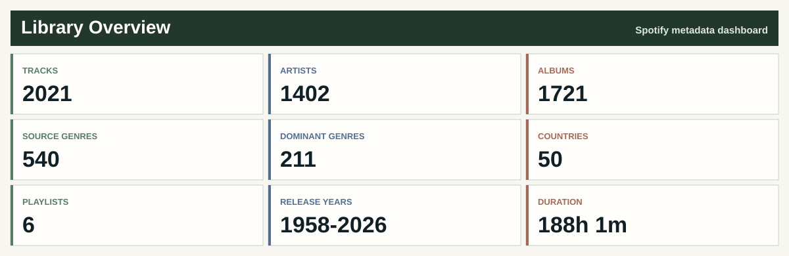
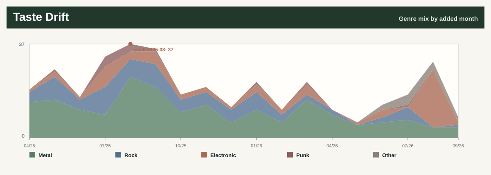
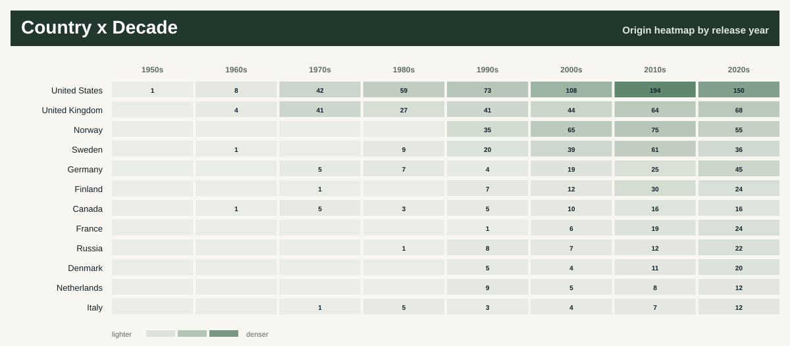
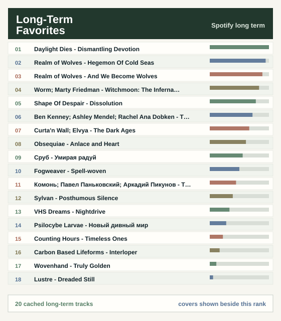
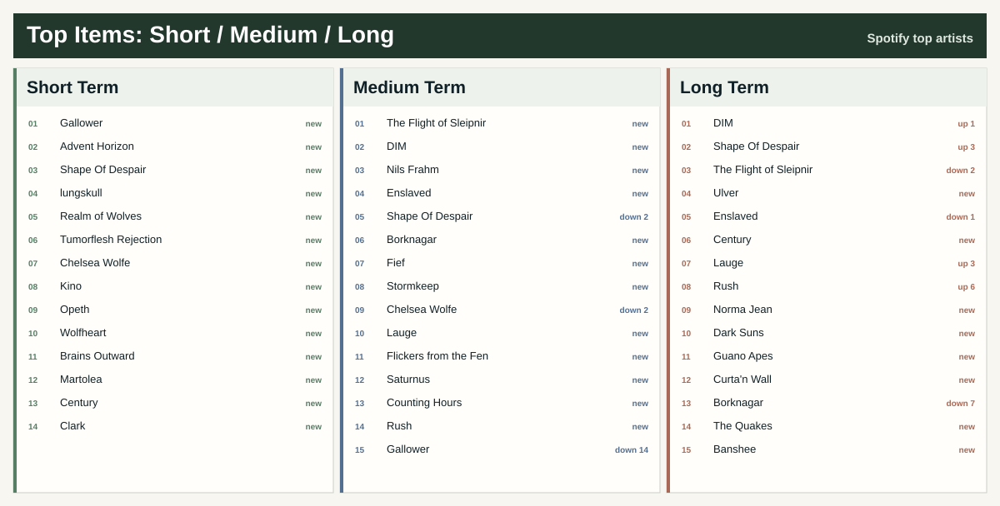
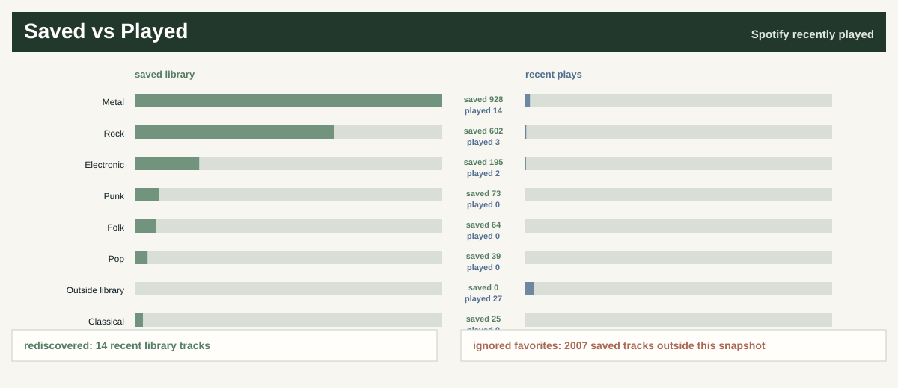
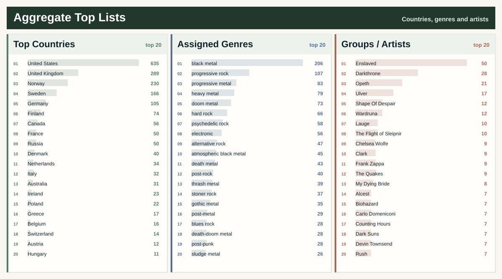

# Spotify Library Dashboard

Automated Spotify library dashboard with genre atlas, country timelines, listening maps, and all-time top songs.

No audio files are included: this repository publishes generated summaries from a private CSV archive.

> Each artist is assigned to exactly one dominant genre. Every genre card below shows top 15 artists, years and countries.

## Listening Maps

### All-Time Top Songs

<table>
<tr>
<td valign="top" width="52%">

</td>
<td valign="top" width="48%">

</td>
</tr>
</table>

## Genre Atlas

## Metal

## Rock / Psych / Prog

## Electronic / Ambient

## Punk / Hardcore

## Folk / World

## Jazz / Blues

## Soul / Funk / R&B

## Reggae / Ska

## Afrobeat / Latin

## Classical / Score

## Pop / Songwriter

## Hip-Hop / Rap

## Experimental / Noise

## Other

## Latest Liked Tracks

<table align="center" cellpadding="4" cellspacing="0">
<thead>
<tr>
<th align="left" valign="top"><small><small><small>Added</small></small></small></th>
<th align="left" valign="top"><small><small><small>Track</small></small></small></th>
<th align="left" valign="top"><small><small><small>Details</small></small></small></th>
</tr>
</thead>
<tbody>
<tr>
<td align="left" valign="top"><small><small><small>2026-06-27</small></small></small></td>
<td align="left" valign="top"><small><small><small><a href="https://open.spotify.com/track/2UTpZhFg9tnzChSHHcoqBq">Ночь темна</a> <small>Baba Yaga Team</small></small></small></small></td>
<td align="left" valign="top"><small><small><small>Василиса и Баба Яга (Original Game Soundtrack) <small>2024</small></small></small></small></td>
</tr>
<tr>
<td align="left" valign="top"><small><small><small>2026-06-26</small></small></small></td>
<td align="left" valign="top"><small><small><small><a href="https://open.spotify.com/track/6RPSdDexmwCZnLRdzfv67G">ΣΤΗΝ ΘΕΟΤΟΚΟ με δίχως τάστα-perdesiz</a> <small>π. Διονύσιος Ταμπάκης</small></small></small></small></td>
<td align="left" valign="top"><small><small><small>Paradise Metal <small>2026 · psychedelic rock</small></small></small></small></td>
</tr>
<tr>
<td align="left" valign="top"><small><small><small>2026-06-23</small></small></small></td>
<td align="left" valign="top"><small><small><small><a href="https://open.spotify.com/track/7LFxWclMQjpARPSThKVAE0">Carrion King</a> <small>Khemmis</small></small></small></small></td>
<td align="left" valign="top"><small><small><small>Khemmis <small>2026 · doom metal</small></small></small></small></td>
</tr>
<tr>
<td align="left" valign="top"><small><small><small>2026-06-23</small></small></small></td>
<td align="left" valign="top"><small><small><small><a href="https://open.spotify.com/track/5VSnXnQktUKOfDyysLMMzx">Ballad of a Fallen Star</a> <small>Stormkeep</small></small></small></small></td>
<td align="left" valign="top"><small><small><small>The Nocturnes of Iswylm <small>2026 · melodic black metal</small></small></small></small></td>
</tr>
<tr>
<td align="left" valign="top"><small><small><small>2026-06-23</small></small></small></td>
<td align="left" valign="top"><small><small><small><a href="https://open.spotify.com/track/5Hh7lLiY3y9ELHs3ZsdAcH">Saccharine Subjugation</a> <small>Stormkeep</small></small></small></small></td>
<td align="left" valign="top"><small><small><small>The Nocturnes of Iswylm <small>2026 · melodic black metal</small></small></small></small></td>
</tr>
<tr>
<td align="left" valign="top"><small><small><small>2026-06-23</small></small></small></td>
<td align="left" valign="top"><small><small><small><a href="https://open.spotify.com/track/4bTmQdOeFL6jHhpzfACpHp">The Black Dragons of Iswylm</a> <small>Stormkeep</small></small></small></small></td>
<td align="left" valign="top"><small><small><small>The Nocturnes of Iswylm <small>2026 · melodic black metal</small></small></small></small></td>
</tr>
<tr>
<td align="left" valign="top"><small><small><small>2026-06-23</small></small></small></td>
<td align="left" valign="top"><small><small><small><a href="https://open.spotify.com/track/3YTA4Y3qWmPEauQ5MIbbKJ">Below The Surface</a> <small>Lauge; Baba Gnohm; JYRANTE</small></small></small></small></td>
<td align="left" valign="top"><small><small><small>Below The Surface <small>2026 · ambient</small></small></small></small></td>
</tr>
<tr>
<td align="left" valign="top"><small><small><small>2026-06-19</small></small></small></td>
<td align="left" valign="top"><small><small><small><a href="https://open.spotify.com/track/2L32tvX6I73xToPvqFMi9k">Don&#x27;t Run Away</a> <small>Amber Creek</small></small></small></small></td>
<td align="left" valign="top"><small><small><small>Don&#x27;t Run Away <small>2026 · electronic</small></small></small></small></td>
</tr>
<tr>
<td align="left" valign="top"><small><small><small>2026-06-19</small></small></small></td>
<td align="left" valign="top"><small><small><small><a href="https://open.spotify.com/track/6nMY6W3CvmBEOHTGrlm6PC">Love Lies Dreaming</a> <small>Yes</small></small></small></small></td>
<td align="left" valign="top"><small><small><small>Aurora (Bonus Tracks Edition) <small>2026 · progressive rock</small></small></small></small></td>
</tr>
<tr>
<td align="left" valign="top"><small><small><small>2026-06-18</small></small></small></td>
<td align="left" valign="top"><small><small><small><a href="https://open.spotify.com/track/5CKwsEAhZogWhqWbGYQ4Da">Between Layers</a> <small>Fionnlagh; Lauge</small></small></small></small></td>
<td align="left" valign="top"><small><small><small>Between Layers <small>2026 · ambient</small></small></small></small></td>
</tr>
<tr>
<td align="left" valign="top"><small><small><small>2026-06-17</small></small></small></td>
<td align="left" valign="top"><small><small><small><a href="https://open.spotify.com/track/4W6MueOc6KliVlG0ZcZLQN">Reflections</a> <small>This Winter Machine</small></small></small></small></td>
<td align="left" valign="top"><small><small><small>The Clockwork Man <small>2023 · progressive rock</small></small></small></small></td>
</tr>
<tr>
<td align="left" valign="top"><small><small><small>2026-06-17</small></small></small></td>
<td align="left" valign="top"><small><small><small><a href="https://open.spotify.com/track/2SV69wiCCKzoFLDs6NWM5N">I Saw the End</a> <small>Pallbearer</small></small></small></small></td>
<td align="left" valign="top"><small><small><small>Heartless <small>2017 · doom metal</small></small></small></small></td>
</tr>
<tr>
<td align="left" valign="top"><small><small><small>2026-06-15</small></small></small></td>
<td align="left" valign="top"><small><small><small><a href="https://open.spotify.com/track/23tqZZq7hLy54A952keiLm">Steppe Grass</a> <small>Magic Man</small></small></small></small></td>
<td align="left" valign="top"><small><small><small>Boards of Mongolia <small>2026 · dungeon synth</small></small></small></small></td>
</tr>
<tr>
<td align="left" valign="top"><small><small><small>2026-06-07</small></small></small></td>
<td align="left" valign="top"><small><small><small><a href="https://open.spotify.com/track/02AshrPDkh1K36dD12f2mn">Crypt of Euphoria</a> <small>dungeontroll</small></small></small></small></td>
<td align="left" valign="top"><small><small><small>Into the Castle of the Forbidden Twilight <small>2020 · dungeon synth</small></small></small></small></td>
</tr>
<tr>
<td align="left" valign="top"><small><small><small>2026-06-04</small></small></small></td>
<td align="left" valign="top"><small><small><small><a href="https://open.spotify.com/track/1Y3US4jr3hPVYd7k5Bmn16">Ghost Limbs</a> <small>Healthyliving</small></small></small></small></td>
<td align="left" valign="top"><small><small><small>Songs of Abundance, Psalms of Grief <small>2023</small></small></small></small></td>
</tr>
<tr>
<td align="left" valign="top"><small><small><small>2026-05-26</small></small></small></td>
<td align="left" valign="top"><small><small><small><a href="https://open.spotify.com/track/7uYRmq6tONjvwUh8wn8zvh">Further in the Making</a> <small>Nils Frahm</small></small></small></small></td>
<td align="left" valign="top"><small><small><small>Old Friends New Friends <small>2021 · modern classical</small></small></small></small></td>
</tr>
<tr>
<td align="left" valign="top"><small><small><small>2026-05-24</small></small></small></td>
<td align="left" valign="top"><small><small><small><a href="https://open.spotify.com/track/57eO5u9HWcifKGw07rrGG4">So I Marched To The Sunken Empire</a> <small>Darkthrone</small></small></small></small></td>
<td align="left" valign="top"><small><small><small>Pre-Historic Metal <small>2026 · black metal</small></small></small></small></td>
</tr>
<tr>
<td align="left" valign="top"><small><small><small>2026-05-15</small></small></small></td>
<td align="left" valign="top"><small><small><small><a href="https://open.spotify.com/track/5IoMPCKmcSlTteXdRVCzCs">Águas Passadas</a> <small>Kaatayra</small></small></small></small></td>
<td align="left" valign="top"><small><small><small>Caminhos de Água <small>2026 · atmospheric black metal</small></small></small></small></td>
</tr>
<tr>
<td align="left" valign="top"><small><small><small>2026-05-15</small></small></small></td>
<td align="left" valign="top"><small><small><small><a href="https://open.spotify.com/track/1YXo39c7oKj77QdON48uIA">Let Us Live</a> <small>Conjurer</small></small></small></small></td>
<td align="left" valign="top"><small><small><small>Unself <small>2025 · sludge metal</small></small></small></small></td>
</tr>
<tr>
<td align="left" valign="top"><small><small><small>2026-05-14</small></small></small></td>
<td align="left" valign="top"><small><small><small><a href="https://open.spotify.com/track/2L9TUkStJsBHh3Xtw8oUOP">Flammifer</a> <small>Summoning</small></small></small></small></td>
<td align="left" valign="top"><small><small><small>Old Mornings Dawn <small>2013 · black metal</small></small></small></small></td>
</tr>
</tbody>
</table>

## Aggregates

Workflow

- `python scripts/export_spotify.py` updates `data/tracks.csv` from saved tracks and owned/collaborative playlists, plus optional Spotify top/recent snapshots.
- `python scripts/enrich_genres_musicbrainz.py` fills blank genres from cached MusicBrainz artist tags.
- `python scripts/backfill_countries_musicbrainz.py --fetch-missing-artists` backfills artist countries from MusicBrainz and Wikidata where available.
- `python scripts/apply_genre_rules.py --overwrite` applies curated genres from `data/genre_rules.csv`.
- `python scripts/build_readme.py` regenerates this README.
- `python scripts/debug_spotify.py` checks OAuth and first Spotify API pages without writing CSV.
- Manual fields in `data/tracks.csv` are preserved on export: `year`, `primary_genre`, `genres`, `rating`, `status`, `tags`, `notes`.
- Weekly GitHub Actions use a private data repository for `data/tracks.csv`; this public repository commits only generated summaries and public rules.

Repeat this

Create a Spotify app, run the local OAuth export once, store the full `data/tracks.csv` in a private data repository, then set public repository secrets described in `DATA.md`. GitHub Actions can refresh the public dashboard weekly without publishing the full CSV. Spotify user refresh tokens expire after six months; when the workflow reports `invalid_grant`, or after adding `user-top-read` / `user-read-recently-played`, reauthorize locally and update the `SPOTIFY_REFRESH_TOKEN` secret.

Data

- Source table: private `data/tracks.csv` fetched during the weekly workflow and not published in this repository.
- Data setup: [`DATA.md`](DATA.md)
- Track CSV example: [`data/tracks.example.csv`](data/tracks.example.csv)
- Genre rules: [`data/genre_rules.csv`](data/genre_rules.csv)
- Country overrides: [`data/country_overrides.csv`](data/country_overrides.csv)
- README generator: [`scripts/build_readme.py`](scripts/build_readme.py)
- Spotify exporter: [`scripts/export_spotify.py`](scripts/export_spotify.py)
- MusicBrainz country backfill: [`scripts/backfill_countries_musicbrainz.py`](scripts/backfill_countries_musicbrainz.py)
- MusicBrainz genre enricher: [`scripts/enrich_genres_musicbrainz.py`](scripts/enrich_genres_musicbrainz.py)
- Genre rule applier: [`scripts/apply_genre_rules.py`](scripts/apply_genre_rules.py)
- Spotify API debug: [`scripts/debug_spotify.py`](scripts/debug_spotify.py)

License

- Repository code and generated dashboard assets: [`MIT License`](LICENSE).
- Spotify, MusicBrainz and Wikidata metadata, plus linked Spotify artwork, remain governed by their source terms.

_Generated at 2026-06-29 10:00 UTC._

Created by Maksim Krutikov.
